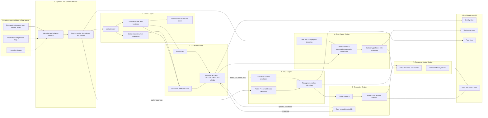
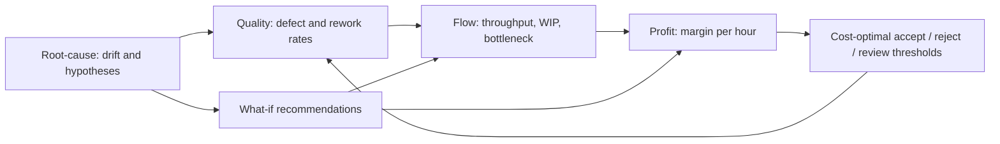

# InspectIQ — Defect-to-Profit Decision Support for Multi-Stage Manufacturing
 
> **NEURAX Hackathon 3.0 · Domain 2: AI in Industry and Automation**
> **Problem Statement:** Visual Inspection & Defect Root-Cause Assistant
> **Team:** `<Team Name>` · **Members:** `<Name 1 (Reg. No.)>`, `<Name 2>`, `<Name 3>` · **Institution:** Chennai Institute of Technology
> **Checkpoint:** 1 (README) · **Status:** Design complete, implementation in progress (see [Roadmap](#12-roadmap-and-checkpoint-mapping))
 
---
 
## Table of Contents
 
1. [One-Paragraph Summary](#1-one-paragraph-summary)
2. [Problem Understanding](#2-problem-understanding)
3. [What Makes Our Solution Different](#3-what-makes-our-solution-different)
4. [System Architecture](#4-system-architecture)
5. [Approach in Detail](#5-approach-in-detail)
6. [Data Strategy and Assumptions](#6-data-strategy-and-assumptions)
7. [Evaluation Plan and Metrics](#7-evaluation-plan-and-metrics)
8. [Explainability, Confidence and Limitations](#8-explainability-confidence-and-limitations)
9. [Dashboard (UI/UX) Plan](#9-dashboard-uiux-plan)
10. [Tech Stack and Feasibility](#10-tech-stack-and-feasibility)
11. [Repository Structure and Setup](#11-repository-structure-and-setup)
12. [Roadmap and Checkpoint Mapping](#12-roadmap-and-checkpoint-mapping)
13. [Scope, Compliance and Ethics](#13-scope-compliance-and-ethics)
14. [Risks and Mitigations](#14-risks-and-mitigations)
15. [References](#15-references)
---
 
## 1. One-Paragraph Summary
 
InspectIQ is a **software-only, advisory** decision-support system that connects four questions manufacturers normally answer in four separate tools: **(1)** *Is this unit defective, and where is the defect?* **(2)** *Which process condition or batch is likely responsible?* **(3)** *Which station is constraining the flow, and what does that cost?* **(4)** *If quality or process settings change, what happens to margin?* We link them through one shared, simulated **digital-twin decision loop**: inspection results feed defect, scrap and rework rates into a flow simulator, the simulator feeds throughput and cost into a profit model, and the profit model in turn sets the **accept/reject/review thresholds** the inspector uses. The system also **abstains** on uncertain or novel defects rather than forcing a guess.
 
---
 
## 2. Problem Understanding
 
### 2.1 The real-world situation
 
High-throughput lines with **multiple stages**, **mixed product variants** and **changing inspection conditions** suffer from a coupled problem:
 
| Layer | What goes wrong | Why it is hard |
|---|---|---|
| **Quality** | Subtle defects (scratches, dents, contamination, misalignment) are missed at line speed; good parts get rejected | Defects are rare, small and vary with lighting, orientation and product variant |
| **Process** | Defect *families* recur and correlate with batch, station or parameter **drift** | Links between images and process data are buried in separate systems |
| **Flow** | Cycle-time imbalance, excess WIP, downtime, changeovers, low utilization, scrap and rework create bottlenecks that **shift over time** | The bottleneck today is not the bottleneck tomorrow, and quality losses change station load |
| **Economics** | Every reject, rework loop and stalled station changes margin | Quality, capacity and profit are usually analysed in isolation |
 
### 2.2 What the problem statement explicitly asks for
 
We treat the following as a **requirement checklist** and trace every item to a module (Section 4):
 
| # | Requirement (from the problem statement) | Our module |
|---|---|---|
| R1 | Classify units as **acceptable / defective** | Vision Engine: anomaly scorer + defect classifier |
| R2 | **Localize** defects where data supports it (boxes / masks / heatmaps) | Vision Engine: anomaly heatmaps → masks → boxes |
| R3 | **Flag uncertain or novel** defect types instead of forcing a guess | Uncertainty Layer: conformal prediction + novelty test + `REVIEW` / `NOVEL` states |
| R4 | Explain **what process condition is likely responsible** | Root-Cause Engine |
| R5 | Identify **industrial bottlenecks** and their effect on **throughput and losses** | Flow Engine: Active Period Method + discrete-event simulation |
| R6 | Predict **profitability / margin** | Economics Engine |
| R7 | Generate **evidence-based process recommendations** | Recommendation Engine (simulated what-if, advisory) |
| R8 | Provide a **continuously updated** view of quality, flow health and profit | Streaming-style replay pipeline + live dashboard |
| R9 | Stay **simulated / advisory**, with **no** live camera, PLC, robot or hardware access | Enforced by design (Section 13) |
 
### 2.3 What the problem statement says we must **not** build
 
The organizers state the objective is **not** *another image classifier, a generic labeling tool, or an isolated KPI dashboard*. Our design responds directly:
 
- Not just a classifier → the classifier is the **first stage** of a loop that ends in a profit estimate and a recommendation.
- Not a labeling tool → we use labels when they exist but do not depend on them (unsupervised anomaly detection is the backbone).
- Not an isolated dashboard → every KPI on screen is **computed from** and **traceable to** the models behind it (evidence panel per unit, per batch, per station).
### 2.4 Key challenges we design for
 
1. **Rare and subtle defects** → few defect samples, imbalanced classes.
2. **Novel defect types** → the model must say "I don't know" rather than guess.
3. **Condition shift** → lighting, orientation, variant and batch changes at test time.
4. **Correlation vs. causation** → root-cause links must be statistically defensible and clearly labelled as *likely*, not proven.
5. **Shifting bottlenecks** → a static "slowest station" answer is not enough.
6. **Economic coupling** → false rejects and false accepts have *different* costs, and rework consumes capacity.
---
 
## 3. What Makes Our Solution Different
 
| # | Differentiator | Why it matters |
|---|---|---|
| D1 | **Economics-aware decision thresholds.** The accept/reject/review threshold is chosen by minimizing *expected cost* (missed-defect cost vs. false-reject cost vs. review cost), not by a fixed 0.5 or F1-optimal cut. | Directly addresses "false-reject / false-accept handling" and ties vision to profit. |
| D2 | **Quality → Flow → Profit feedback loop.** Defect rate and rework rate from vision are fed into a discrete-event simulation of the line; simulated throughput and scrap feed the margin model. | One connected system instead of three disconnected tools; enables real what-if answers. |
| D3 | **Calibrated abstention with a novelty queue.** Conformal prediction gives statistically calibrated prediction sets; unknown patterns become `NOVEL` and are grouped into *candidate new defect families* for a human to name. | Meets the "flag novel defects" requirement with a defensible guarantee instead of a raw softmax score. |
| D4 | **Drift-aware root-cause engine.** Change-point detection on process signals plus multiple-testing-corrected association tests link defect families to batch / station / parameter windows, with an explicit *confidence* and *alternative explanations* list. | Produces valid, auditable links instead of a single "top feature" claim. |
| D5 | **Shifting-bottleneck detection, not just utilization.** Active Period Method (momentary and average bottlenecks) validated against a simulated line; then a sensitivity test estimates the throughput gain from relieving each station. | Answers "where is the constraint *now*, and what is it worth to fix?" |
| D6 | **Cold-start friendly.** Anomaly detection trains on normal images only; supervised classification is added only if labelled defects exist. | Works even when defect samples are scarce, which is the realistic case. |
| D7 | **Evidence-first UI.** Every alert shows the image, heatmap, score, calibrated confidence, nearest normal reference, linked batch/process evidence and simulated financial impact. | Judges (and operators) can verify claims instead of trusting a number. |
 
---
 
## 4. System Architecture
 
### 4.1 End-to-end view
 

 
### 4.2 Module responsibilities
 
| # | Module | Inputs | Outputs | Key technique |
|---|---|---|---|---|
| 1 | **Ingestion & Schema Adapter** | Raw images, CSV/Parquet logs, cost tables | Validated, joined, time-ordered records keyed by `unit_id`, `batch_id`, `station_id`, `variant_id` | Pydantic schemas, adapter pattern so a new dataset needs only a mapping file |
| 2 | **Vision Engine** | Image + variant | Anomaly score, heatmap, mask, box, defect family (if supervised) | Pretrained-feature anomaly detection (PatchCore / EfficientAD via Anomalib); optional lightweight classifier head |
| 3 | **Uncertainty Layer** | Scores, class probabilities, embeddings | Calibrated prediction set, novelty flag, final decision | Split conformal prediction + embedding-distance novelty test |
| 4 | **Root-Cause Engine** | Decisions + defect family + process/batch data | Ranked, evidence-backed hypotheses with confidence | Change-point detection, chi-square / Fisher tests with FDR correction, gradient-boosted model with SHAP |
| 5 | **Flow Engine** | Station state logs, cycle times, buffers, downtime, changeovers, scrap/rework | Momentary and average bottleneck, WIP, utilization, throughput loss | Active Period Method + SimPy discrete-event simulation |
| 6 | **Economics Engine** | Flow results, defect rates, cost table | Contribution margin per unit / batch / hour, forecast with interval, cost-optimal thresholds | Throughput-accounting unit economics + quantile gradient boosting |
| 7 | **Recommendation Engine** | Root-cause + flow + economics outputs | Ranked what-if actions with expected Δthroughput, Δscrap, Δmargin | Scenario simulation (all advisory) |
| 8 | **Dashboard & API** | All engine outputs | Operator and judge-facing views | FastAPI + Streamlit |
 
### 4.3 Data flow for a single unit (worked example)
 
1. Image of unit `U-10482` (variant `B`, batch `B-77`, station `S3`) arrives from the replay stream.
2. **Variant router** picks the reference model for variant `B`.
3. **Vision Engine** returns anomaly score `0.91` and a heatmap with a hotspot near the upper-left edge; a mask and bounding box are derived.
4. **Uncertainty Layer** produces a prediction set `{scratch}` at 90% coverage, and the embedding is *within* known-family range → decision **REJECT** with calibrated confidence.
5. **Root-Cause Engine** notes that scratches on variant `B` rose after batch `B-77` and co-occur with a station `S2` parameter drift → hypothesis with confidence and a list of alternative explanations.
6. **Flow Engine** shows `S4` is the current bottleneck and rework from scratches adds load to it.
7. **Economics Engine** estimates the margin impact of the scratch rate.
8. **Recommendation Engine** suggests a simulated parameter correction on `S2` and shows the projected change in scrap, throughput and margin.
*(All identifiers and values above are illustrative.)*
 
### 4.4 The feedback loop (our core idea)
 

 
---
 
## 5. Approach in Detail
 
### 5.1 Vision Engine: detection, classification, localization
 
**Design principle:** *anomaly detection first, classification second.* Anomaly detection learns what "normal" looks like from defect-free images, so it is the most robust option when defect samples are few, and it naturally produces **heatmaps for localization**. A supervised head is added only when labelled defect data exists.
 
**Step 1 — Variant routing.** Extract a global embedding with a pretrained backbone; a lightweight nearest-centroid router assigns each image to its product variant so each variant gets its own normal-reference memory. This handles mixed variants and keeps false rejects low.
 
**Step 2 — Anomaly scoring and heatmap.**
- **Primary:** PatchCore-style patch-feature memory bank (coreset-subsampled) using a pretrained WideResNet backbone. PatchCore reports image-level AUROC of about 99% on MVTec AD, and it needs no defect examples.
- **Speed option:** EfficientAD (student–teacher) if runtime latency becomes the constraint.
- Both are available through the open-source **Anomalib** library, which keeps the pipeline reproducible.
**Step 3 — Localization.** The patch-level anomaly map is upsampled and smoothed, thresholded into a **mask**, and converted to **bounding boxes** by connected components. Where ground-truth masks exist, we tune the mask threshold on validation data only.
 
**Step 4 — Defect-family classification (when labels exist).** A small classifier (linear/MLP head on frozen backbone features, or a fine-tuned lightweight CNN) predicts the defect family. When labels are absent, we **cluster** anomalous-patch embeddings (e.g. HDBSCAN) into *candidate families* and let a human name them once.
 
**Step 5 — Robustness to unseen conditions.**
- Memory bank is built from normal images with **photometric augmentation** (brightness, contrast, gamma, mild blur/noise) and **small rotations/flips** so orientation and lighting changes do not look like defects.
- **Per-batch feature normalization** to reduce batch-to-batch appearance drift.
- A **test-time alignment/registration** fallback for orientation shifts, since patch-memory methods are known to be sensitive to misalignment.
- We evaluate explicitly on **held-out batches, lighting shifts and unseen variants** (Section 7).
### 5.2 Uncertainty Layer: calibrated confidence and abstention
 
Raw model scores are usually over-confident, so we calibrate them.
 
- **Split conformal prediction:** on a held-out calibration set we compute non-conformity scores and a quantile threshold. For a chosen error level α (e.g. 10%), the resulting prediction set contains the true class with at least 1−α probability under exchangeability. It works on top of any model.
- **Decision states:**
| State | Rule (simplified) | Meaning |
|---|---|---|
| `ACCEPT` | Low anomaly score and prediction set = {normal} | Confident good unit |
| `REJECT` | High anomaly score and prediction set = {one defect family} | Confident defect |
| `REVIEW` | Prediction set has multiple classes, or score is near the threshold | Ambiguous → send to human |
| `NOVEL` | High anomaly score but embedding far from all known defect families | Possible new defect type; added to the novelty queue |
 
- **Honest limitation:** conformal guarantees are *marginal* and assume calibration data resembles test data. Under strong distribution shift the guarantee weakens, so the dashboard also tracks **drift in score distributions** and warns when calibration may be stale (Section 8).
### 5.3 Root-Cause Engine: linking defects to process and batch data
 
Goal: produce **valid, auditable hypotheses**, not causal claims.
 
1. **Aggregate** decisions by `defect_family × batch × station × variant × time window`.
2. **Detect drift** in process signals (temperature, pressure, speed, tool wear, supplier lot, etc., depending on what is provided) with change-point detection (e.g. PELT/CUSUM) and control-chart rules.
3. **Test associations** between defect-family rates and categorical factors (batch, station, shift, supplier) using chi-square / Fisher exact tests with **Benjamini–Hochberg false-discovery correction**; for continuous parameters use point-biserial / mutual-information screening.
4. **Multivariate check:** a gradient-boosted model predicts defect occurrence from process variables; **SHAP** shows which variables matter and in what direction, to catch effects that pairwise tests miss.
5. **Temporal precedence:** a drift only counts as a candidate cause if it **precedes** the rise in the defect family.
6. **Output:** ranked hypotheses, each with an effect size, an adjusted p-value or stability score, the supporting time window, and an explicit **"alternative explanations / confounders"** list (e.g. batch and station are correlated).
7. **Validation on simulated ground truth:** we inject known process faults into synthetic data and measure whether the engine recovers them (precision/recall of injected causes).
### 5.4 Flow Engine: bottlenecks, throughput and losses
 
**Bottleneck detection**
- **Active Period Method (Roser et al.):** at any moment the station with the longest uninterrupted active period is the momentary bottleneck; overlapping periods show the bottleneck *shifting*. It needs only station-state data (active vs. blocked/starved), not the material-flow structure.
- **Complementary indicators** when state logs are limited: utilization, queue/WIP length, blocked/starved time, cycle-time imbalance, downtime and changeover share.
**Throughput and loss estimation**
- Build a **discrete-event simulation (SimPy)** of the multi-stage line from the provided data: station cycle-time distributions, buffer sizes, downtime/repair, changeovers between variants, scrap and rework loops (rework re-enters an upstream station and consumes capacity).
- **Calibrate** the simulation so its throughput and WIP match the historical data, then run **sensitivity experiments**: "what if station *k* were 10% faster?" → change in throughput, WIP and cost. This ranks stations by *value of relief*.
- **Loss breakdown:** lost units split into scrap, rework capacity, downtime, changeover and starvation/blocking.
### 5.5 Economics Engine: profitability and margin
 
- **Unit economics:** `margin = price − material − conversion − scrap cost − rework cost − inspection cost − downtime/idle cost` (exact fields depend on the organizer's data).
- **Throughput accounting:** because a bottleneck limits the whole line, an hour lost at the bottleneck is an hour of *system* output lost; we value it accordingly.
- **Margin prediction:** a quantile gradient-boosting model (or simulation-based Monte Carlo) gives a **point forecast with prediction intervals** per batch/day.
- **Cost-optimal decision thresholds (D1):** given the cost of a false accept (escape/warranty/downstream scrap), a false reject (lost good unit), and a review (labor), we choose the threshold that **minimizes expected cost**, and show the ROC/cost curve so the trade-off is visible.
### 5.6 Recommendation Engine (advisory only)
 
For each hypothesis or bottleneck, the engine runs a **what-if simulation** and reports:
 
| Field | Example |
|---|---|
| Action | "Recalibrate parameter X on station S2 to its pre-drift range" |
| Evidence | Link to drift plot, association result and defect examples |
| Expected effect | Δ defect rate, Δ throughput, Δ scrap, Δ margin with an interval |
| Confidence & caveats | Confidence label, assumptions, confounders |
| Status | **Simulated / advisory — not executed** |
 
Recommendations are ranked by expected margin gain, discounted by confidence.
 
---
 
## 6. Data Strategy and Assumptions
 
The problem statement says the system analyzes **organizer-provided inspection, production and economic datasets**. The exact schema was not fixed when this README was written, so the pipeline is built around an **adapter layer**: a small YAML mapping file translates any provided columns into our internal schema.
 
**Expected inputs (to be confirmed against the provided data):**
 
| Data group | Expected content | Used by |
|---|---|---|
| Inspection | Images, labels (good/defect, family), optional masks/boxes, variant, lighting/orientation tags | Vision, Uncertainty |
| Production / process | `unit_id`, `batch_id`, `station_id`, timestamps, cycle times, station states, downtime, changeovers, WIP, process parameters | Root-Cause, Flow |
| Economic | Selling price, material/conversion cost, scrap and rework cost, downtime cost, inspection cost | Economics |
 
**Handling gaps (assumptions we will state on the dashboard, never hide):**
 
- *No defect labels* → unsupervised anomaly detection + clustering into candidate families.
- *No masks* → localization shown as heatmaps/boxes and judged qualitatively; pixel metrics only where ground truth exists.
- *No station-state logs* → fall back to utilization/queue/cycle-time indicators and the simulation.
- *Missing cost fields* → clearly labelled, editable default assumptions.
- *Small data* → leakage-safe splits by **batch** (never random by image), reported with confidence intervals.
**Supplementary data for development and stress-testing only:** public benchmarks such as **MVTec AD** and **VisA** (defect localization), and **NEU-DET** / **Severstal**-style steel-surface sets (multi-class defects) can be used to validate methods, and a **synthetic line generator** creates known-ground-truth process faults and bottlenecks for testing the Root-Cause and Flow engines. Final reported results come from the organizer-provided data.
 
---
 
## 7. Evaluation Plan and Metrics
 
We mirror the judging criteria so we can show evidence for each.
 
| Judging criterion | How we measure it |
|---|---|
| **Detection & classification accuracy** | Image-level AUROC and AUPRC; precision, recall, F1 per defect family; confusion matrix; false-reject rate at fixed recall |
| **Defect localization quality** | Pixel AUROC, **AUPRO**, IoU / Dice against masks, box precision/recall on unseen samples; heatmap overlays for qualitative review |
| **Robustness to unseen conditions** | Metric drop under (a) held-out batch, (b) lighting/contrast shift, (c) rotation/orientation, (d) unseen variant, (e) novel defect type |
| **False-reject / false-accept handling** | Cost curve, threshold chosen by expected cost, false-accept vs. false-reject rate, review-queue size |
| **Root-cause correlation quality** | Precision/recall of recovered causes on synthetic injected faults; stability across resamples; adjusted p-values; lag/precedence checks |
| **Explainability & confidence** | Calibration curve and expected calibration error (ECE), conformal coverage vs. target, abstention rate vs. accuracy on retained samples |
| **Technical implementation** | One-command setup, fixed seeds, pinned dependencies, unit tests, per-image latency and throughput reported |
| **UI/UX & visualization** | Task-based walkthrough: an operator can locate a defect, see the evidence, find the bottleneck and read the margin impact within a few clicks |
 
**Protocol rules:** splits by batch; calibration set separate from test set; thresholds tuned only on validation data; all metrics reported with the exact configuration used.
 
> **Targets vs. results:** the figures in this README that come from the literature (e.g. PatchCore on MVTec AD) describe the *method's* published performance on a benchmark, not our results. Our own results will be reported in `docs/results.md` once experiments run on the provided data.
 
---
 
## 8. Explainability, Confidence and Limitations
 
**What the user sees for every flagged unit**
- Original image + anomaly heatmap overlay + mask/box
- Anomaly score and **calibrated** confidence (prediction set and coverage level)
- Nearest normal reference image and, if available, nearest known defect example
- Decision state (`ACCEPT / REJECT / REVIEW / NOVEL`) and the reason
- Linked batch/station/process evidence and the root-cause hypothesis with confidence
- Simulated cost impact of this defect family
**Known limitations (stated up front)**
1. Conformal guarantees are **marginal** and rely on calibration data resembling test data; strong shift can weaken them (mitigated by drift monitoring and recalibration prompts).
2. Patch-memory anomaly detectors can be **sensitive to misalignment** and to global/logical defects (e.g. wrong assembly); we flag such cases as lower-confidence and route them to review.
3. Root-cause outputs are **statistical hypotheses**, not proven causes; confounding is listed explicitly.
4. Flow and profit numbers are **simulation-based estimates**; their accuracy depends on how well the simulation is calibrated to the provided data.
5. Localization quality can only be quantified where ground-truth masks or boxes are provided.
---
 
## 9. Dashboard (UI/UX) Plan
 
Four linked views plus a global filter bar (variant, batch, station, time window):
 
| View | Purpose | Main components |
|---|---|---|
| **Quality** | Live inspection status | Unit stream, defect-rate trend by family, review/novelty queue, image + heatmap evidence panel, confusion matrix |
| **Root Cause** | Why defects happen | Defect-family × batch/station heatmap, drift timelines with change-points, ranked hypotheses with confidence and confounders |
| **Flow** | Where the line is constrained | Station Gantt with active periods, bottleneck timeline (shifting), WIP/utilization, loss waterfall (scrap, rework, downtime, changeover, starvation) |
| **Profit & What-If** | What it costs and what to do | Margin trend with interval, cost-optimal threshold curve, scenario sliders (defect rate, station speed, changeover), ranked recommendations tagged **Simulated / Advisory** |
 
Design rules: evidence within one click of every number; uncertainty always visible; every scenario clearly labelled as simulated.
 
---
 
## 10. Tech Stack and Feasibility
 
| Layer | Choice | Why it is feasible |
|---|---|---|
| Language | Python 3.10+ | Single language across ML, simulation, API and UI |
| Vision | PyTorch, **Anomalib**, torchvision, OpenCV | Off-the-shelf PatchCore / EfficientAD; pretrained backbones; runs on CPU for demo scale, faster with GPU |
| Uncertainty | NumPy / scikit-learn, custom split-conformal utilities (optionally MAPIE) | Lightweight, no extra infrastructure |
| Root cause | pandas, SciPy, statsmodels, ruptures, LightGBM, SHAP | Standard, well-documented libraries |
| Flow | SimPy, `active_period_method` package or own implementation | Discrete-event simulation and bottleneck detection without proprietary tools |
| Economics | pandas, LightGBM (quantile), Monte Carlo | Interpretable and fast |
| Backend / UI | FastAPI + Streamlit (Plotly for charts) | Fast to build, easy to demo |
| Reproducibility | Docker, pinned `requirements.txt`, fixed seeds, `Makefile`, pytest | One-command run |
 
**Feasibility notes**
- Anomaly detection uses **frozen pretrained backbones** with a memory bank, so there is **no long GPU training** phase.
- The whole system runs **offline on replayed data**, so there is no dependency on cameras, PLCs or external services.
- Modules are **loosely coupled** through typed records, so the team can build and test them in parallel and degrade gracefully (e.g. the dashboard still works if a module falls back to a simpler baseline).
---
 
## 11. Repository Structure and Setup
 
```text
inspectiq/
├── README.md
├── requirements.txt / environment.yml
├── Dockerfile
├── Makefile
├── configs/
│   ├── schema_mapping.yaml        # adapter: organizer columns -> internal schema
│   ├── vision.yaml                # backbone, coreset ratio, image size
│   ├── uncertainty.yaml           # alpha, novelty threshold
│   ├── flow.yaml                  # station params, buffers
│   └── economics.yaml             # cost assumptions (editable)
├── data/
│   ├── raw/                       # organizer data (not committed)
│   └── synthetic/                 # generated test lines with injected faults
├── src/
│   ├── ingestion/                 # validation, adapters, replay engine
│   ├── vision/                    # router, anomaly scorer, classifier, localization
│   ├── uncertainty/               # conformal, novelty, decision policy
│   ├── rootcause/                 # drift, association tests, SHAP
│   ├── flow/                      # active-period method, SimPy model
│   ├── economics/                 # unit economics, margin forecast, thresholds
│   ├── recommend/                 # what-if scenarios, ranking
│   └── api/                       # FastAPI endpoints
├── dashboard/                     # Streamlit app
├── tests/
├── notebooks/                     # exploration and evaluation
└── docs/
    ├── architecture.md
    ├── results.md                 # filled in from Checkpoint 2 onward
    └── assumptions.md
```
 
**Quick start (target interface)**
 
```bash
git clone <repo-url> && cd inspectiq
make setup                  # create env and install pinned dependencies
make data                   # place organizer data in data/raw and run adapter
make train                  # build normal-reference memory banks and calibrate
make run                    # start API + dashboard
make test                   # run unit tests
```
 
> The commands above define the interface we are building toward; the repository will be updated as each checkpoint is completed.
 
---
 
## 12. Roadmap and Checkpoint Mapping
 
| Checkpoint | Marks | Deliverable | Planned content |
|---|---|---|---|
| **1 — README** | 15 | This document | Problem understanding (5), architecture (5), approach (5) |
| **2 — Partial execution** | 25 | Working vertical slice | Ingestion + adapter, anomaly detection with heatmaps, first decision states, basic flow simulation and bottleneck view, first dashboard pages, early margin estimate |
| **3 — Final evaluation** | 60 | Full system and results | Classification + localization metrics, robustness tests, conformal calibration and novelty handling, root-cause validation, calibrated what-if recommendations, polished dashboard, `docs/results.md` |
 
**Suggested build order (team of 3–4):** ① Ingestion + Vision → ② Uncertainty + decisions → ③ Flow + Economics → ④ Root-Cause → ⑤ Recommendations + dashboard integration → ⑥ Robustness testing and documentation.
 
---
 
## 13. Scope, Compliance and Ethics
 
- **Software-only.** No live camera feed, PLC connection, robotic sorting, machine control or production-line hardware access is used or required.
- **Advisory and simulated.** All recommendations, bottleneck interventions and profit estimates are presented as *simulated / advisory*, never as executed actions.
- **Human in the loop.** Uncertain and novel cases are routed to human review by design.
- **Data handling.** Only organizer-provided datasets (plus clearly labelled public benchmarks or synthetic data for development) are used; assumptions are documented in `docs/assumptions.md`.
- **Transparency.** Every number on the dashboard can be traced to its inputs and model.
---
 
## 14. Risks and Mitigations
 
| Risk | Impact | Mitigation |
|---|---|---|
| Provided data lacks defect labels or masks | Cannot report supervised metrics | Unsupervised backbone; clustering into candidate families; qualitative localization evidence |
| Lighting / orientation shift causes false rejects | Lower precision | Photometric + geometric augmentation, per-batch normalization, registration fallback, review state |
| Novel defects misclassified as known ones | Silent misses | Conformal sets + embedding-distance novelty test + `NOVEL` queue |
| Spurious root-cause links | Misleading recommendations | FDR correction, temporal-precedence rule, confounder list, validation on injected faults |
| Simulation does not match the real line | Wrong throughput/profit estimates | Calibrate to historical throughput and WIP; show uncertainty; keep outputs advisory |
| Compute limits during hackathon | Slow inference | Coreset subsampling, smaller image size, EfficientAD option, cached embeddings |
| Scope too large | Incomplete demo | Modular design with baselines for each module; vertical slice first (Checkpoint 2) |
 
---
 
## 15. References
 
1. Roth, K. et al. *Towards Total Recall in Industrial Anomaly Detection (PatchCore).* CVPR 2022. https://arxiv.org/abs/2106.08265
2. Batzner, K. et al. *EfficientAD: Accurate Visual Anomaly Detection at Millisecond-Level Latencies.* WACV 2024. https://arxiv.org/abs/2303.14535
3. Akcay, S. et al. *Anomalib: A Deep Learning Library for Anomaly Detection.* https://arxiv.org/abs/2202.08341
4. Bergmann, P. et al. *MVTec AD — A Comprehensive Real-World Dataset for Unsupervised Anomaly Detection.* CVPR 2019.
5. Roser, C., Nakano, M., Tanaka, M. *Shifting Bottleneck Detection.* Winter Simulation Conference, 2002. https://www.informs-sim.org/wsc02papers/145.pdf
6. Vovk, V., Gammerman, A., Shafer, G. *Algorithmic Learning in a Random World* (conformal prediction); Angelopoulos, A. & Bates, S. *A Gentle Introduction to Conformal Prediction and Distribution-Free Uncertainty Quantification.*
7. Goldratt, E. *The Goal* / Theory of Constraints (throughput accounting).
8. Shen, Y. & Liu, F. *Conformal Segmentation in Industrial Surface Defect Detection with Statistical Guarantees.* 2025. https://arxiv.org/abs/2504.17721
9. Benjamini, Y. & Hochberg, Y. *Controlling the False Discovery Rate.* JRSS-B, 1995.
10. Lundberg, S. & Lee, S.-I. *A Unified Approach to Interpreting Model Predictions (SHAP).* NeurIPS 2017.
---
 
*Prepared for NEURAX Hackathon 3.0 · Domain 2: AI in Industry and Automation.*
 
